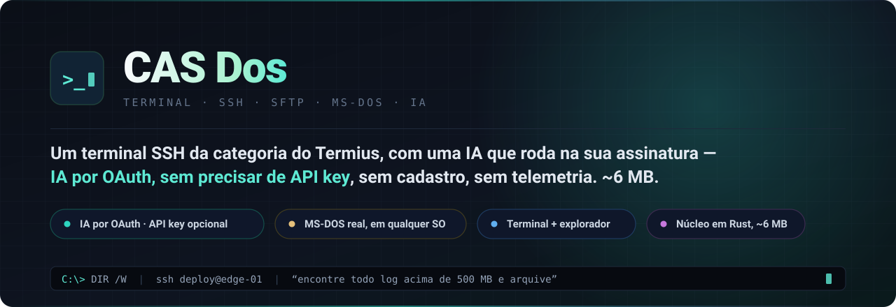
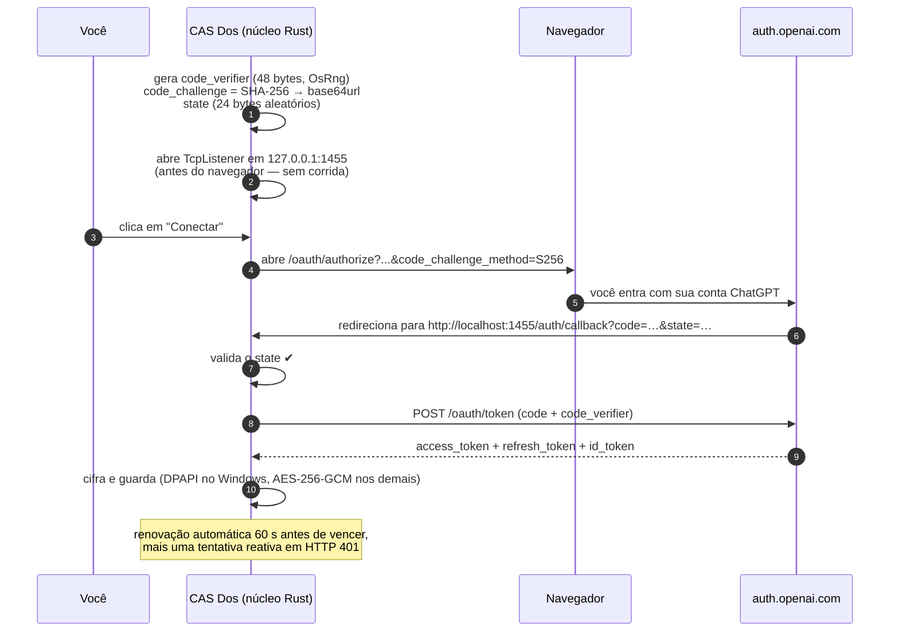
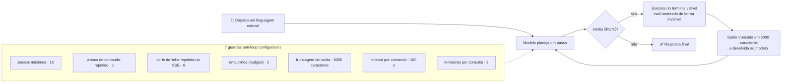

<div align="center">



**Um terminal SSH da categoria do Termius, com uma IA que roda na sua assinatura por padrão — ou na sua própria API key, se preferir. Sem cadastro, sem telemetria.**
Mais um interpretador MS-DOS de verdade que funciona em qualquer sistema operacional, e um explorador de arquivos encaixado ao lado do seu shell.

[](#-instalação)
[](https://tauri.app)
[](https://react.dev)
[](#-instalação)
[](#-a-parte-da-ia-a-mais-interessante)
[](#-segurança-e-privacidade)

</div>

---

## O que é isto

O CAS Dos é um cliente SSH de desktop no espírito do Termius, construído sobre um **núcleo em Rust (Tauri 2)** com interface em **React + TypeScript**. Ele cabe em um **instalador de 2,32 MB** e um **executável portátil de 6,15 MB** — sem Chromium embutido, sem runtime Node, sem serviço rodando em segundo plano.

Só que "mais um cliente SSH" não é a graça. Três coisas mudam o jogo:

| | |
|---|---|
| 🧠 **IA sem API key — por padrão** | Você entra com a **sua assinatura do ChatGPT** por OAuth 2.0 + PKCE de verdade; não precisa de mais nada. Prefere a sua chave? Existe um modo de API **opcional** e multi-provedor (OpenAI, Anthropic, Gemini, xAI, DeepSeek, Groq, Mistral, OpenRouter, Together, Perplexity, Ollama, LM Studio ou qualquer endpoint compatível com OpenAI). |
| 🖥️ **MS-DOS que roda mesmo** | Um interpretador DOS escrito do zero em Rust. `DIR /W`, `XCOPY /S /E`, arquivos `.BAT` com `GOTO` e `FOR` — funcionando nativamente **também no macOS e no Linux**, operando no sistema de arquivos real. Não é um invólucro do `cmd.exe`. |
| 🗂️ **Terminal e explorador lado a lado** | Um clique divide a área de trabalho. O explorador **acompanha o seu `cd`** sozinho — local, ou remoto via SFTP quando a sessão é SSH. |

Tudo é em **Português do Brasil** — a interface e as mensagens. Isso é uma decisão deliberada, não um descuido.

---

## Índice

- [Instalação](#-instalação)
- [A parte da IA (a mais interessante)](#-a-parte-da-ia-a-mais-interessante)
- [A camada MS-DOS](#-a-camada-ms-dos)
- [A tela dividida](#-a-tela-dividida)
- [SSH, SFTP e túneis](#-ssh-sftp-e-túneis)
- [Segurança e privacidade](#-segurança-e-privacidade)
- [O que ainda *não* faz](#-o-que-ainda-não-faz)
- [Perguntas frequentes](#-perguntas-frequentes)
- [Avisos](#-avisos)

---

## 📦 Instalação

Baixe o pacote do seu sistema na página de [**Releases**](../../releases).

| Sistema | Arquivo | Observações |
|---|---|---|
| **Windows 10/11 (x64)** | `CAS.Dos_1.0.0_x64-setup.exe` ou `CAS.Dos_1.0.0_x64_en-US.msi` | Instaladores. O WebView2 já vem nos sistemas atualizados |
| **Windows (sem instalar)** | `CAS.Dos_1.0.0_x64-portatil.exe` | Um único arquivo de 6,15 MB, roda de qualquer lugar |
| **macOS (Apple Silicon)** | `CAS.Dos_1.0.0_aarch64.dmg` | Macs com chip M1 ou mais novo |
| **macOS (Intel)** | `CAS.Dos_1.0.0_x64.dmg` | Macs com processador Intel |

Confira o que você baixou antes de executar: calcule o SHA-256 do arquivo e compare com a linha correspondente do `SHA256SUMS.txt` publicado no mesmo Release.

No Windows:

```powershell
Get-FileHash .\CAS.Dos_1.0.0_x64-setup.exe -Algorithm SHA256
```

No macOS:

```bash
shasum -a 256 CAS.Dos_1.0.0_aarch64.dmg
```

> ⚠️ **Os binários não são assinados digitalmente.** O SmartScreen do Windows vai avisar — clique em *Mais informações → Executar assim mesmo*. No macOS o Gatekeeper bloqueia aplicativos não assinados; remova a marca de quarentena com:
>
> ```bash
> xattr -dr com.apple.quarantine "/Applications/CAS Dos.app"
> ```

---

## 🧠 A parte da IA (a mais interessante)

A maioria dos terminais "com IA" pede uma API key e depois cobra por token, em cima da assinatura que você já paga. O CAS Dos faz o contrário.

### Ele entra da mesma forma que as CLIs oficiais

O núcleo em Rust implementa o **mesmo fluxo "Entrar com o ChatGPT" que a CLI do Codex usa** — OAuth 2.0 com **PKCE (S256)**, do começo ao fim, nativamente:



Detalhes que fazem diferença:

- O servidor de callback é um **`std::net::TcpListener` da biblioteca padrão** — sem tokio, sem hyper, sem axum. Não-bloqueante, com verificação a cada 120 ms, devolvendo uma página HTML amigável.
- Ele escuta em **`127.0.0.1`, nunca em `0.0.0.0`** — o callback não fica acessível pela sua rede.
- O `state` é gerado e **validado** na volta. O listener sobe *antes* do navegador, então não existe condição de corrida.
- **Nenhuma chave embutida.** O caminho OAuth não precisa de chave nenhuma; o modo de API opcional guarda o seu token **cifrado com DPAPI** (um por provedor), fora de qualquer arquivo de configuração.

### Três formas de usar

**1. Perguntar** — um painel de chat com **streaming SSE real**, então os tokens aparecem conforme são gerados. São **15 modelos** selecionáveis, e o padrão é propositalmente o mais barato.

**2. Sugerir comando** — descreva em linguagem natural o que você quer e receba o comando pronto. Nada executa até você mandar.

**3. Soltar o agente autônomo** — aqui fica divertido. Você diz o objetivo; o agente propõe comandos, **executa no terminal que você está vendo**, lê a saída e decide o próximo passo.



O agente roda **no terminal que você enxerga** — não em um shell escondido. Ele acompanha a sua pasta atual entre um comando e outro usando um marcador invisível, então nenhum comando extra aparece na sua tela. O cancelamento é verificado em **quatro pontos distintos**, inclusive no meio do streaming. Cada um dos sete limites é ajustável nas Configurações e passa por `clamp()` no backend — um valor errado no arquivo de configuração não quebra nada.

### Ele também conduz as CLIs oficiais

Se você prefere as ferramentas dos próprios fornecedores, o CAS Dos detecta **`codex`, `claude`, `gemini` e `copilot`/`gh`** no seu `PATH`, mostra o status de cada uma e executa o **login OAuth dentro de uma aba de terminal do próprio aplicativo**. A detecção percorre o `PATH` na mão, testando `.exe/.cmd/.bat/.com` no Windows — nunca chama `which`/`where`, então nada pisca na tela.

> **Leia isto, por favor.** O caminho OAuth autentica no backend da OpenAI usando o cliente público da CLI do Codex. Ou seja: o seu uso é regido pela **sua assinatura e pelos Termos de Serviço da OpenAI**. Este projeto é independente e não é afiliado nem endossado pela OpenAI. Leia os termos antes de usar, e use a sua própria conta.
>
> **E isto também.** O agente autônomo **executa comandos de shell com os seus privilégios**. Ele tem guardas fortes contra *laço infinito*, mas nenhuma lista de bloqueio contra comandos *destrutivos*. Leia o que ele propõe. Não aponte para produção e saia de perto.

---

## 🖥️ A camada MS-DOS

Não é emulação. Não é invólucro do `cmd.exe`. É um **interpretador de comandos escrito do zero em Rust** que opera no sistema de arquivos real — e por isso se comporta de forma idêntica no Windows, no macOS e no Linux.

**53 comandos internos**, mais **40 comandos legados** reconhecidos e neutralizados com segurança (39 recebem a mensagem segura; `FASTHELP` é interceptado antes como alias de `HELP`).

```
ATTRIB  BREAK  CALL  CD  CHDIR  CHCP  CHKDSK  CHOICE  CLS  COLOR  COPY  DATE
DEL  DELTREE  DIR  DOSKEY  ECHO  EDIT  ERASE  EXIT  FC  FIND  FOR  GOTO  HELP
IF  LABEL  MD  MEM  MKDIR  MORE  MOVE  MSD  PATH  PAUSE  PROMPT  RD  REM  REN
RENAME  RMDIR  SCANDISK  SET  SHIFT  SORT  TIME  TITLE  TREE  TYPE  VER
VERIFY  VOL  XCOPY
```

Switches realmente implementados, não decorativos:

| Comando | Switches |
|---|---|
| `DIR` | `/W /B /S /L /P /A:[DHRSA]` (com negação `-`) `/O:[NGSDE]` (com inversão `-`) |
| `XCOPY` | `/S /E` |
| `FIND` | `/V /C /N /I` |
| `SORT` | `/R /+n` |
| `TREE` | `/F /A` |
| `RD` | `/S /Q` · `DEL` `/Q` · `DELTREE` `/Y` |
| `ATTRIB` | `+/-R` nativo |
| `CHOICE` | `/C /N /M` |

Os **curingas** `*` e `?` viram padrões ancorados e sem diferenciar maiúsculas; `*.*` significa tudo, exatamente como em 1994. O `REN` ainda aceita curinga no *destino*.

**Um motor `.BAT` completo:** rótulos, `GOTO` (inclusive `:EOF`), `IF [NOT] [/I] ERRORLEVEL|EXIST|==`, `FOR %x IN (…) DO`, `CALL`, `SHIFT`, `%0..%9`, `%*`, silenciamento com `@` e `REM`. O aninhamento de lotes é limitado a **8 níveis** e um laço desgovernado é cortado em **100.000 passos**.

E aí vêm os detalhes difíceis de fingir:

- **`PAUSE` e `CHOICE` dentro de um `.BAT` suspendem a execução de verdade** — a fila de lotes aninhados congela, a pergunta faz o caminho de ida e volta até a interface, e a execução retoma exatamente onde parou. Isso é uma máquina de estados de continuação, não um laço.
- **Diretório atual por unidade no Windows.** Digitar `D:` troca de unidade e lembra em que pasta você estava em cada uma — igual ao original. No macOS e no Linux, `C:` mapeia para `/` e as outras letras devolvem um erro amigável.
- **`PROMPT` com 13 códigos** (`$P $G $L $B $Q $S $D $T $V $N $E $_ $$`), com padrão `$P$G`.
- **Pipeline** (`|`) e **redirecionamento** (`>`, `>>`, `<`), interpretados respeitando aspas.
- Comando desconhecido é repassado ao sistema operacional — exatamente como o MS-DOS fazia com programas externos.

### Os comandos destrutivos são comprovadamente inertes

`FORMAT`, `FDISK`, `SYS`, `RECOVER`, `UNFORMAT` e outros 34 comandos legados são reconhecidos e respondidos com uma mensagem segura em português. Eles nunca tocam em disco.

Isso não é um comentário nem uma boa intenção — é estrutural. A função que trata esses comandos recebe os argumentos como `_argumentos` (**descartados por design**) e o corpo dela não contém **nenhuma chamada a `fs::`, `Command`, `remove_*`, `write` ou `create`**. É uma função pura de string. E, no despachante, o braço dos legados vem **antes** do braço "executar como programa externo" — nada escapa por baixo.

As três operações realmente destrutivas que *são* permitidas (`DEL *`, `RD /S`, `DELTREE`) exigem confirmação digitada, e só a tecla `S` prossegue — uma tecla inválida mantém a pergunta na tela. Não existe "sim por padrão".

---

## 🗂️ A tela dividida

```
┌───────────┬──────────────────────────────────────────────────────────────┐
│           │  ▸ local   ▸ dos   ▸ ssh: edge-01   ▸ ia            [ + ]    │
│  Hosts    ├────────────────────────────────┬─────────────────────────────┤
│  Chaves   │                                │  📁 Explorador              │
│  Snippets │   user@edge-01:/var/log$ _     │  /var/log                   │
│  IA       │                                │  ├── nginx/                 │
│  Config.  │                                │  ├── syslog        4,2 MB   │
│           │                                │  └── auth.log      812 KB   │
│           │                                ├──── arraste p/ ajustar ─────┤
│           │                                │  🤖 Chat com a IA           │
│           │                                │  "arquive todo log          │
│           │                                │   acima de 500 MB"          │
└───────────┴────────────────────────────────┴─────────────────────────────┘
             ↑ divisor arrastável (15%–85%)
```

Um botão divide a área de trabalho. O painel da direita assume um de quatro estados: **nada**, **explorador**, **chat com a IA** ou **ambos** (empilhados, com um segundo divisor arrastável próprio).

O explorador **acompanha o terminal**. Ele lê as sequências de escape OSC 7 e OSC 0/2 direto do fluxo de bytes — nenhum comando extra é injetado no seu shell, nada aparece na tela. Você dá `cd`, a árvore anda junto.

Ele se comporta como um gerenciador de arquivos que você já conhece: **8 modos de exibição** espelhando o Windows Explorer, ordenação, soma de tamanho de pastas, menu de contexto completo, propriedades com permissões em octal, pré-visualização dentro do app, envio e download de vários arquivos e de pastas inteiras, compactação e extração remotas, e elevação por `sudo` para caminhos privilegiados — com a senha do sudo mantida em memória por uma única operação e jamais gravada.

---

## 🔐 SSH, SFTP e túneis

Construído sobre o **libssh2** (crate `ssh2`), com **três modos de autenticação**: senha, chave privada (com frase secreta opcional) e **ssh-agent** — percorrendo as identidades do agente até uma funcionar.

Um detalhe que vale saber: no Windows, o libssh2 usa o backend **WinCNG**, que não consegue autenticar a partir de uma chave em memória. O CAS Dos contorna gravando a chave em um arquivo temporário (modo `0o600` no Unix), usando e **apagando imediatamente**.

**19 operações SFTP** — listar, baixar, enviar, enviar pasta recursivamente, excluir, renomear, mover, copiar, criar pasta, propriedades, chmod octal, compactar/extrair remotamente, somar tamanho de pastas (`du -sb` em uma única ida ao servidor), além de leitura e exclusão elevadas por sudo.

**Encaminhamento de porta local** com desligamento limpo: um `TcpListener` não-bloqueante alimentando `channel_direct_tcpip`, com bomba de dados bidirecional e uma flag `AtomicBool` para parar.

As sessões de shell local rodam em um **PTY de verdade** (`portable-pty` — ConPTY no Windows), e há **12 temas de cores** para o terminal.

---

## 🛡️ Segurança e privacidade

**Não existe backend.** Este projeto não opera servidor nenhum. Nada do que você digita, acessa ou abre é enviado para lugar algum, exceto para o host SSH que você escolheu e — se você ligar a IA — para a OpenAI, na sua própria conta. **Sem telemetria, sem analytics, sem conta, sem cadastro.**

| Preocupação | Como é tratada |
|---|---|
| **Hosts, chaves, snippets** | Cifrados com **AES-256-GCM** (nonce de 12 bytes por `OsRng`) na pasta de dados do aplicativo do sistema — nunca na pasta do projeto |
| **Tokens OAuth e histórico de chat** | **DPAPI** no Windows (`CryptProtectData`, por uma FFI `extern "system"` escrita à mão ligando `crypt32` — sem crate de terceiros), AES-256-GCM nos demais sistemas |
| **API keys** | **Opcionais**, uma por provedor. Guardadas **cifradas via DPAPI** — nunca no arquivo de configuração, nunca enviadas a ninguém além do provedor escolhido |
| **Senhas de `sudo`** | Ficam em memória por uma única operação, nunca são persistidas |
| **Comandos DOS destrutivos** | Estruturalmente inertes (veja acima) |
| **Superfície de ataque** | Apenas **3 permissões Tauri** declaradas: `core:default`, `core:window:allow-set-title` e `opener:default`. Nenhum plugin de sistema de arquivos, shell ou HTTP — todo acesso a disco, SSH e rede passa por 72 comandos Rust |
| **Dependências** | **9 pacotes npm em runtime** e 14 crates Rust diretas. Superfície pequena |
| **Cofre corrompido** | Vira `.bak` e é recriado, em vez de travar o aplicativo |

As lacunas conhecidas, ditas com todas as letras:

- **A CSP está `null`** no `tauri.conf.json`. Não existe `innerHTML`, `dangerouslySetInnerHTML` nem `<iframe>` em nenhum ponto do frontend — o React e o xterm.js escapam tudo — então uma CSP seria uma segunda camada de defesa, não o conserto de um buraco aberto. Está no roteiro.
- **O agente autônomo não tem lista de bloqueio de comandos.** As guardas impedem laço, não destruição.
- **O arquivo de token é gravado sem ACL restritiva.** Ele é cifrado, mas as permissões do arquivo são as padrão do sistema.
- **O identificador Tauri embute um domínio legado de empresa** (`br.com.futuraexpress.casdos`). Alterá-lo abandonaria as pastas de dados dos usuários atuais, então ele permanece.

---

## 🚧 O que ainda *não* faz

Uma lista honesta vale mais do que uma lista de marketing.

- **Nenhum teste automatizado.** Zero. Nem um `#[test]`, nem teste de frontend. A validação foi manual.
- **Não há versão para Android nem iOS.** Trate mobile como não implementado, e não como "em breve".
- **Só o Windows x64 foi testado na prática.** Os pacotes de macOS são gerados por build automatizado e ainda não passaram por teste em um Mac de verdade.
- **Não há busca no terminal.**
- **Não há atalhos de teclado globais** — ainda não existem `Ctrl+T`, `Ctrl+W` nem `Ctrl+Tab`.
- **Alguns switches do DOS são aceitos e ignorados** em vez de recusados: `COPY /Y /V /B /A`, `DEL /P /F /S /A`, `XCOPY /Y /Q /I /F /H /K /V`. Eles são interpretados, só não mudam o comportamento.
- **O `MEM` reporta a RAM real e moderna**, não a ficção dos 640 KB de memória convencional. O `DIR` não imprime o número de série do volume.
- **A compactação depende de ferramentas do sistema** — `zip`/`unzip`/`tar` precisam existir localmente e no servidor remoto.
- **Os binários não são assinados digitalmente.** Sem certificado Authenticode, sem Apple Developer ID.
- **O bloqueio dos legados casa por nome exato.** `format.com` ou `diskpart` não estão na lista e seriam repassados ao shell do sistema como qualquer outro programa externo.

---

## ❓ Perguntas frequentes

**Preciso de uma API key da OpenAI?**
Não. Por padrão a IA roda na sua assinatura do ChatGPT, por OAuth. Se você *quiser* usar a sua própria chave, ative o modo de API opcional no painel de IA e escolha entre 13 provedores — ou qualquer endpoint compatível com OpenAI.

**Funciona sem a IA?**
Completamente. SSH, SFTP, explorador, camada DOS e túneis não encostam no código da IA.

**Onde ficam os meus dados?**
Na pasta de dados de aplicativo do seu sistema, cifrados. Nunca em um servidor. Não existe servidor.

**O código-fonte está disponível?**
Não. Este repositório distribui apenas os binários do CAS Dos.

**Isto é um fork do Termius?**
Não. Não contém nenhuma linha de código do Termius. O nome é citado apenas para descrever a categoria de software.

**Tem alguma ligação com a Microsoft ou com a OpenAI?**
Não. "MS-DOS" é marca da Microsoft; este é uma reimplementação independente do conjunto clássico de comandos, escrita do zero e sem acesso a código-fonte da Microsoft. A integração com a OpenAI usa um cliente OAuth público e está sujeita aos Termos de Serviço da OpenAI.

---

## 📄 Avisos

Este repositório distribui apenas os binários do CAS Dos; o código-fonte não é publicado. O software é fornecido como está, sem garantia de qualquer tipo.

Os componentes de terceiros embutidos nos binários permanecem sob as licenças deles — veja o [NOTICE](NOTICE). "MS-DOS" é marca da Microsoft Corporation e "Termius" da Termius Corporation; ambas são citadas apenas de forma descritiva. Este projeto é independente e não tem vínculo com a Microsoft, a OpenAI, a Termius ou qualquer outra empresa aqui mencionada.

<div align="center">

**Feito com Rust, React e uma quantidade pouco razoável de atenção ao `DIR /W`.**

</div>
